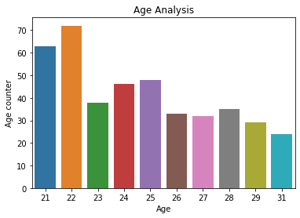

# Diabetes  Prediction

## Objective

Original dataset    :  https://archive.ics.uci.edu/ml/datasets/diabetes

Kaggle Competitions :  https://www.kaggle.com/uciml/pima-indians-diabetes-database

## Overview
This dataset is originally from the National Institute of Diabetes and Digestive and Kidney Diseases. The objective of the dataset is to diagnostically predict whether or not a patient has diabetes, based on certain diagnostic measurements included in the dataset. Several constraints were placed on the selection of these instances from a larger database. In particular, all patients here are females at least 21 years old of Pima Indian heritage.


### Techniques Used

- Data Cleaning
- Data Visualization
- Machine Learning Modeling

### Algortihms Used

1. Logistic Regression
2. KNN
3. Support Vector Machine
4. Naivye Bayes
5. Random Forest Classifier
6. Decision Tree
7. XGboost

### Accuracy We got

1. Logistic Regression		: 77.92%
2. KNN						: 74.92%
3. Support Vector Machine	: 78.57%
4. Naivye Bayes				: 77.27%
5. Random Forest Classifier	: 80.52%
6. Decision Tree			: 79.22%
7. XGboost					: 75.32%


### Age Analysis


## Guide Lines 

### Packages and Tools Required:
```
Pandas 
Matplotlib
Seaborn
Scikit Learn
Jupyter Notebook
```
### Package Installation
```
pip install numpy
pip install pandas
pip install seaborn
pip install scikit-learn
pip install matplotlib
```
